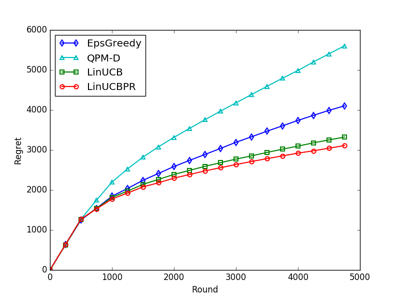

## Contextual Bandit with Piled Rewards

Python implementation of our paper [Linear Upper Confidence Bound Algorithm for Contextual Bandit Problem with Piled Rewards](https://doi.org/10.1007/978-3-319-31750-2_12) and related algorithms, including:

- Linear Upper Confidence Bound with Pseudo Reward (LinUCBPR)
- Linear Upper Confidence Bound (LinUCB)
- Queued Partial Monitoring with Delays (QPM-D)
- Epsilon-Greedy (EpsGreedy)
- Random Sampling

If you find our paper or implementation is useful in your research, please consider citing our paper for LinUCBPR and the
references below for other algorithms.

    @inproceedings{Huang2016linucbpr,
        author    = {Kuan-Hao Huang and
                     Hsuan-Tien Lin},
        title     = {Linear Upper Confidence Bound Algorithm for Contextual Bandit Problem with Piled Rewards},
        booktitle = {Proceedings of the Pacific-Asia Conference on Knowledge Discovery and Data Mining (PAKDD)},
        pages     = {143--155},
        year      = {2016},
    }

### Prerequisites 
- Python 2.7.12
- NumPy 1.13.3
- Matplotlib 1.5.1

### Usage 

    $ python demo.py
    
### Result

### Reference

- Peter Auerand, Nicolò Cesa-Bianchi, and Paul Fischer.
  Finite-Time Analysis of the Multiarmed Bandit Problem.
  Machine learning, 2002.
  
- Wei Chu, Lihong Li, Lev Reyzin, and Robert E. Schapire.
  Contextual Bandits with Linear Payoff Functions.
  AISTATS, 2011.

- Pooria Joulani, András György, and Csaba Szepesvári.
  Online Learning under Delayed Feedback.
  ICML, 2013

- Kuan-Hao Huang and Hsuan-Tien Lin.
  Linear Upper Confidence Bound Algorithm for Contextual Bandit Problem with Piled Rewards.
  PAKDD, 2016

### Author

Kuan-Hao Huang / [@ej0cl6](http://ej0cl6.github.io/)
